# Intro to ggplot2 for R data visualizations

## Motivation

- human brains are wired to process visual information quickly and
  recognize patterns
- well designed data visualizations can often bring a story to life and
  assist with further insights investigation
- ggplot2 is a popular R package for data visualization and a useful
  tool for analysts to have in their toolbox

## ggplot2 Overview

- ggplot2 created by Hadley Wickham and part of the R tidyverse
  ecosystem
- [package documentation and further learning
  resources](https://ggplot2.tidyverse.org/)
- works best with tidy data input format (e.g. observations as rows and
  variables as columns)
- pros
  - open-source and free R package
  - 101 level knowledge can help analysts produce business value quickly
  - used to produce publication worthy visualizations for tech and
    non-tech audiences
  - highly flexible and customizable
  - robust documentation, blog content, and community support (which
    means lots of training data for GenAI tools)
  - high ROI on learning time invested; analysts can use the package
    across companies (vs paid tools which company A may use but not
    company B)
  - [rich collection of extension
    packages](https://exts.ggplot2.tidyverse.org/gallery/)
    (e.g. patchwork, gganimate, ggforce, ggtext, etc.)
  - can be used to produce static and interactive visualizations for
    wide range of data types (e.g. time series, geospatial, etc.)
  - proficient users can produce complex visualizations with a few lines
    of code (often faster than other data vis tools)
- cons
  - requires some basic R coding skills (R is known to have a slow /
    steep learning curve)
  - advanced custom plots require deep knowledge of package nuances
    (which can be hard to remember); tools like Github Copilot reducing
    the cognitive load here
  - setup data shaping/wrangling work needed at times
  - plot outputs to Google Docs or Slides require partially manual
    workflow
  - analyst-to-analyst shareability can be a challenge if the recipient
    is not familiar with R/ggplot2 (Google Sheets, GUI based tools, etc
    often more accessible across data teams)

## Key Components

- **layers:** ggplot builds plots layer by layer in a logical order
- **aesthetics mapping (aes):** instructions for how the data will map
  to a graphic (axis, colors, shapes, lines, etc)
- **geometries (geoms)**: determines the graphic used to visually
  display the data
- **facets**: used to split data into subplots based on 1 or more
  variables
- **labs:** title, axis names, captions, legend titles, etc.
- **themes**: used to reduce visual noise, add polish, and tweak
  formatting

## Packages

``` r
# ggplot2 included in the tidyverse package
required_packages <- c('tidyverse', 'janitor', 'skimr', 'patchwork',
                       'rvest', 'directlabels', 'ggrepel', 'ggpubr')

### check for required packages and install them if they are not already installed
### not a best practice in general, but useful for folks getting started with R
for(p in required_packages) {
  if(!require(p,character.only = TRUE)) 
        install.packages(p, repos = "http://cran.us.r-project.org")
  library(p,character.only = TRUE)
}
```

## Practice Dataset 1

- wine ratings and chemical properties of Vinho Verde red wine samples
  from the north of Portugal
- UCI ML dataset (more details
  [here](https://archive.ics.uci.edu/ml/datasets/Wine+Quality))
- code to access and clean the data hidden to keep the focus on ggplot2

<!-- -->

    Rows: 1,599
    Columns: 13
    $ fixed_acidity        <dbl> 7.4, 7.8, 7.8, 11.2, 7.4, 7.4, 7.9, 7.3, 7.8, 7.5…
    $ volatile_acidity     <dbl> 0.700, 0.880, 0.760, 0.280, 0.700, 0.660, 0.600, …
    $ citric_acid          <dbl> 0.00, 0.00, 0.04, 0.56, 0.00, 0.00, 0.06, 0.00, 0…
    $ residual_sugar       <dbl> 1.9, 2.6, 2.3, 1.9, 1.9, 1.8, 1.6, 1.2, 2.0, 6.1,…
    $ chlorides            <dbl> 0.076, 0.098, 0.092, 0.075, 0.076, 0.075, 0.069, …
    $ free_sulfur_dioxide  <dbl> 11, 25, 15, 17, 11, 13, 15, 15, 9, 17, 15, 17, 16…
    $ total_sulfur_dioxide <dbl> 34, 67, 54, 60, 34, 40, 59, 21, 18, 102, 65, 102,…
    $ density              <dbl> 0.9978, 0.9968, 0.9970, 0.9980, 0.9978, 0.9978, 0…
    $ p_h                  <dbl> 3.51, 3.20, 3.26, 3.16, 3.51, 3.51, 3.30, 3.39, 3…
    $ sulphates            <dbl> 0.56, 0.68, 0.65, 0.58, 0.56, 0.56, 0.46, 0.47, 0…
    $ alcohol              <dbl> 9.4, 9.8, 9.8, 9.8, 9.4, 9.4, 9.4, 10.0, 9.5, 10.…
    $ quality              <dbl> 5, 5, 5, 6, 5, 5, 5, 7, 7, 5, 5, 5, 5, 5, 5, 5, 7…
    $ quality_group        <fct> 5, 5, 5, 6, 5, 5, 5, 7 to 8, 7 to 8, 5, 5, 5, 5, …

## Summary Stats

- not leveraging ggplot2 here
- quick context building step to get a feel for the dataset

``` r
rw_df %>%
  # approach to quickly produce summary stats
  skimr::skim_without_charts() %>%
  # return the numeric subtable produced by skim above
  yank("numeric") %>%
  # no missing data and all variables have a complete rate of 1
  select(-n_missing, -complete_rate) %>%
  # rounds numeric columns to 2 decimal places
  mutate_if(is.numeric, ~round(., 2)) %>%
  # used to produce user friendly output table
  knitr::kable()
```

| skim_variable        |  mean |    sd |   p0 |   p25 |   p50 |   p75 |   p100 |
|:---------------------|------:|------:|-----:|------:|------:|------:|-------:|
| fixed_acidity        |  8.32 |  1.74 | 4.60 |  7.10 |  7.90 |  9.20 |  15.90 |
| volatile_acidity     |  0.53 |  0.18 | 0.12 |  0.39 |  0.52 |  0.64 |   1.58 |
| citric_acid          |  0.27 |  0.19 | 0.00 |  0.09 |  0.26 |  0.42 |   1.00 |
| residual_sugar       |  2.54 |  1.41 | 0.90 |  1.90 |  2.20 |  2.60 |  15.50 |
| chlorides            |  0.09 |  0.05 | 0.01 |  0.07 |  0.08 |  0.09 |   0.61 |
| free_sulfur_dioxide  | 15.87 | 10.46 | 1.00 |  7.00 | 14.00 | 21.00 |  72.00 |
| total_sulfur_dioxide | 46.47 | 32.90 | 6.00 | 22.00 | 38.00 | 62.00 | 289.00 |
| density              |  1.00 |  0.00 | 0.99 |  1.00 |  1.00 |  1.00 |   1.00 |
| p_h                  |  3.31 |  0.15 | 2.74 |  3.21 |  3.31 |  3.40 |   4.01 |
| sulphates            |  0.66 |  0.17 | 0.33 |  0.55 |  0.62 |  0.73 |   2.00 |
| alcohol              | 10.42 |  1.07 | 8.40 |  9.50 | 10.20 | 11.10 |  14.90 |
| quality              |  5.64 |  0.81 | 3.00 |  5.00 |  6.00 |  6.00 |   8.00 |

## Building the Layers Step by Step

1.  pipe (`%>%`) a dataset into ggplot

``` r
### outputs blank plot object with no data mapping
rw_df %>%
  ggplot()
```


2.  set mapping for how the data will be visually represented

``` r
# add x and y axis mapping to blank plot object (called aesthetics mapping)
rw_df %>%
  ggplot(aes(x = volatile_acidity, y = alcohol))
```

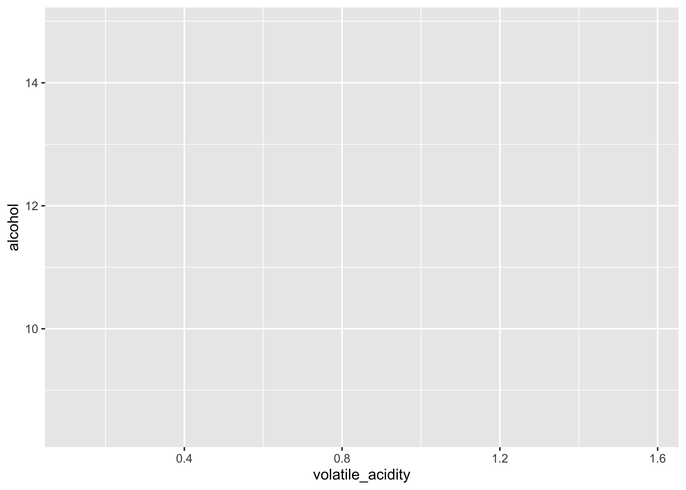

3.  specify a geom (e.g. graphic type) to visually represent the data

``` r
# adds points to the plot object with x and y axis mapped
rw_df %>%
  ggplot(aes(x = volatile_acidity, y = alcohol)) +
  geom_point()
```

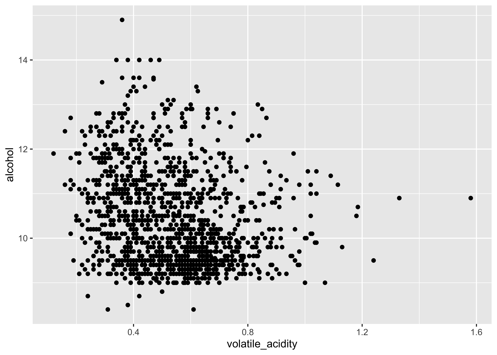

4.  adjust point size and alpha parameter to handle overplotting

``` r
# darker region highlights the primary cluster of data
rw_df %>%
  ggplot(aes(x = volatile_acidity, y = alcohol)) +
  geom_point(size = 0.9, alpha = 0.4)
```

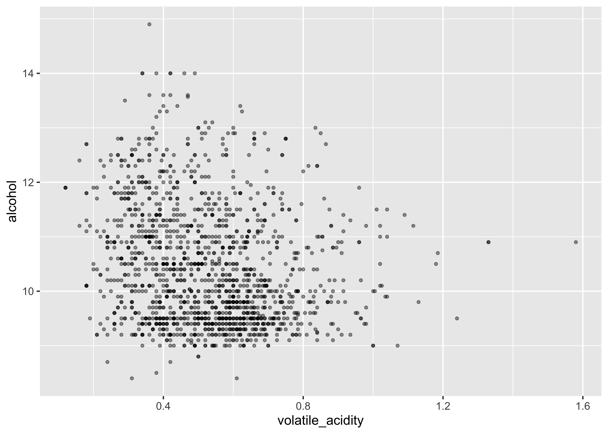

5.  use color to distinguish between different quality groups

``` r
# set color to quality_group within the aesthetics mapping logic
rw_df %>%
  ggplot(aes(x = volatile_acidity, y = alcohol, color = quality_group)) +
  geom_point(size = 0.9, alpha = 0.4)
```

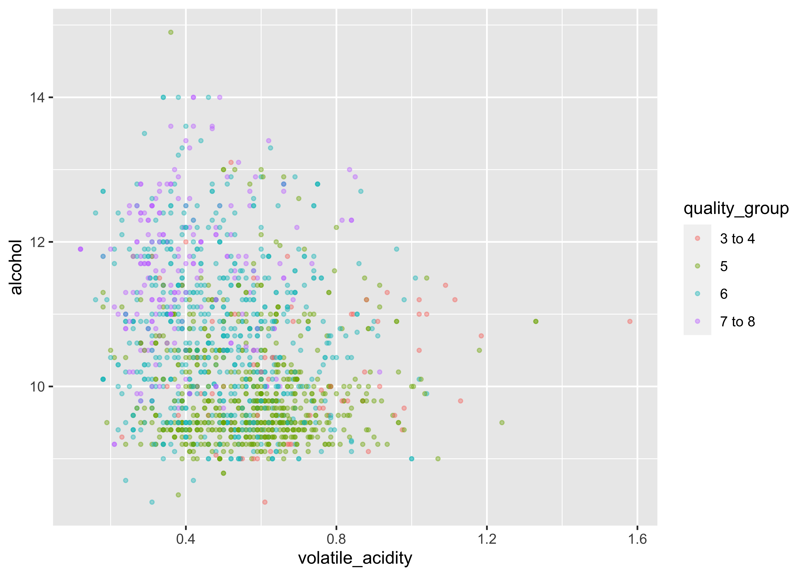

6.  use facets to split the data into subplots based on quality group

- overplotting on above iteration making it hard to see differences
  between quality groups

``` r
rw_df %>%
  ggplot(aes(x = volatile_acidity, y = alcohol, color = quality_group)) +
  # drop legend to reduce visual noise; facet headers provide the same info
  geom_point(size = 0.9, alpha = 0.4, show.legend = F) +
  theme(legend.position = "top") +
  # split the data into subplots based on quality group
  # facet_wrap or facet_grid are the most common facet functions
  facet_wrap(. ~ quality_group, ncol = 2)
```

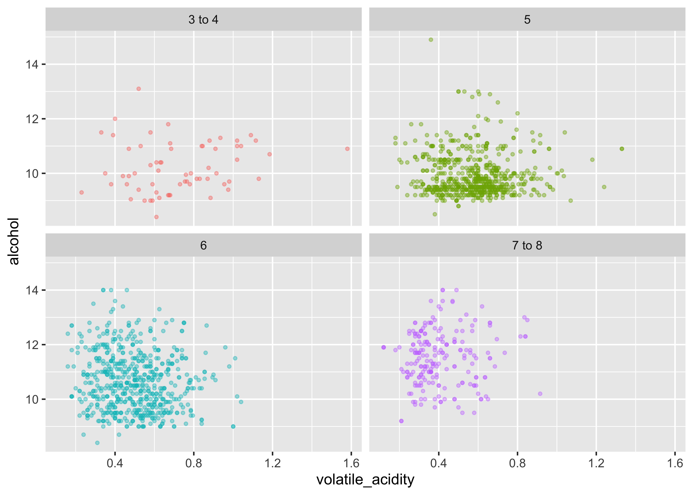

7.  add median vertical and horizontal lines to enhance group vs group
    comparison

``` r
rw_df %>%
  ggplot(aes(x = volatile_acidity, y = alcohol, color = quality_group)) +
  geom_point(size = 0.9, alpha = 0.4, show.legend = F) +
  ### dynamically add median reference lines
  geom_vline(aes(xintercept = median(volatile_acidity)), 
             linetype = "dashed", color = "grey40") +
  geom_hline(aes(yintercept = median(alcohol)), 
                 linetype = "dashed", color = "grey40") +
  facet_wrap(. ~ quality_group, ncol = 2)
```


8.  add titling and finalize styling

``` r
### assign plot object to a variable (used downstream)
p1 <- rw_df %>%
  ggplot(aes(x = volatile_acidity, y = alcohol, color = quality_group)) +
  ### note linetype aes mapping "hack" to surface the median legend title
  geom_vline(aes(xintercept = median(volatile_acidity), 
                 linetype = "Median"), color = "grey40",
                 show.legend = F) +
  geom_hline(aes(yintercept = median(alcohol), 
                 linetype = "Median"), color = "grey40") +
  geom_point(size = 0.9, alpha = 0.4, show.legend = F) +
  facet_wrap(. ~ quality_group, ncol = 2) +
  labs(title = "Red Wine Alcohol and Volatile Acidity by Quality Group",
       subtitle = "top rated wines tend to have lower volatile acidity and higher alcohol %",
       linetype = "",
       x = "Volatile Acidity",
       y = "Alcohol %")

### return plot object
p1
```

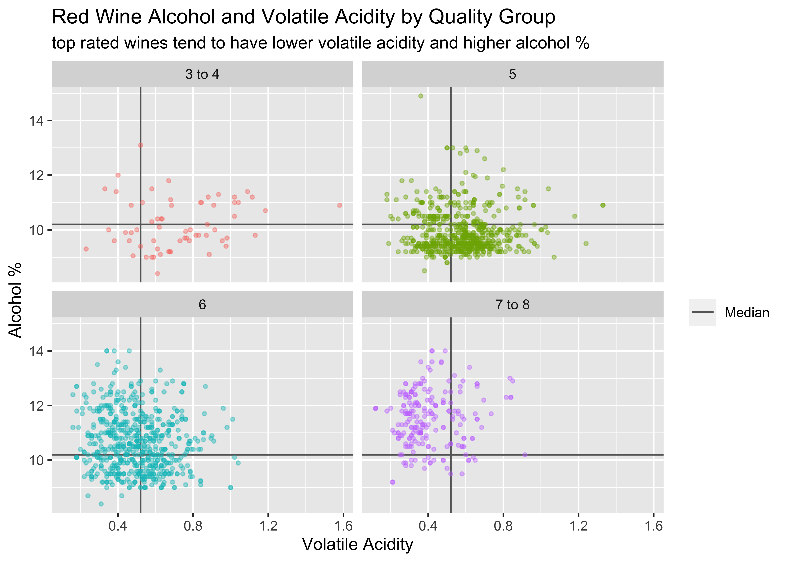

9.  save the plot to an image file

``` r
### saved to working directory
ggsave("red_wine_quality_group_alcohol_and_va.png", p1, width = 10, height = 6)
```

## Starting Point Visualization Use Cases

### Bar Charts

- Basic out of the box bar chart

``` r
rw_df %>%
  ggplot(aes(x = quality_group)) +
  ### stat = "count" is the default, included to be explicit
  ### counts number of observations in each x axis variable
  geom_bar(stat = "count") +
  labs(title = "Red Wine Quality Group Counts",
       x = "Quality Group",
       y = "Count")
```

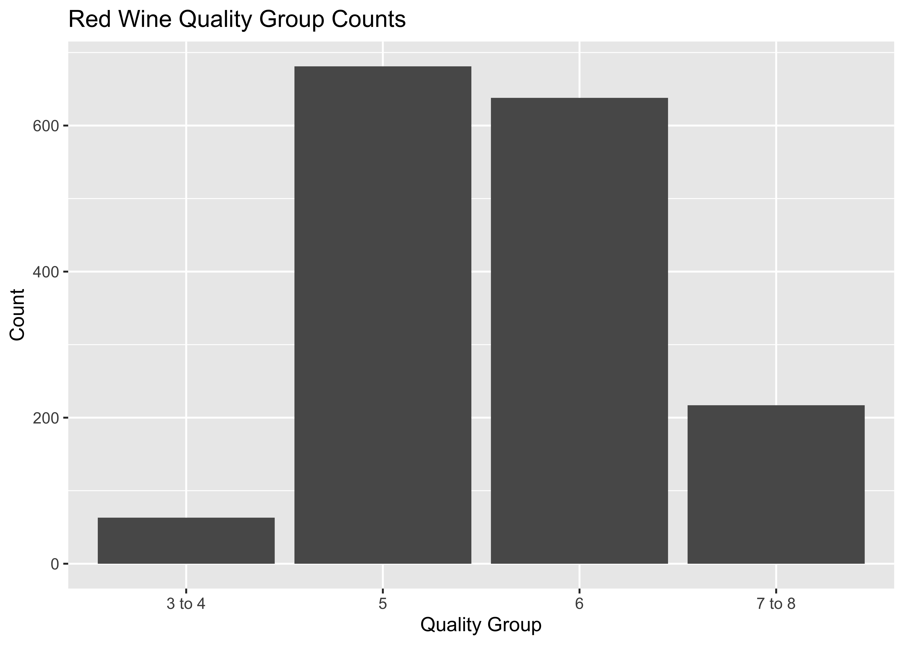

- Elevated / custom bar chart design

``` r
rw_df %>%
  ggplot(aes(x = quality_group)) +
  ### alpha adjusts the transparency of the bars
  geom_bar(stat = "count", alpha = 0.75, show.legend = F, fill = "dodgerblue") +
  ### add counts slightly below the top of each bar
  geom_text(
    stat = "count",   
    aes(
        label = paste0("n=", after_stat(count)),
        y = after_stat(count)
      ), 
    vjust = 1.5
  ) +
  ### add percent total labels to the top of each bar
  geom_text(
    stat = "count",   
    aes(
        label = scales::percent(
            after_stat(count)/sum(after_stat(count)),
            accuracy = 1
          ),
        y = after_stat(count)
      ), 
    vjust = -0.5
  ) +
  ### increase font size of x axis and remove y axis labels and ticks
  theme(axis.text.x = element_text(size = 12),
        ### drop y axis labels and ticks
        axis.ticks.y = element_blank(),
        axis.text.y = element_blank()) +
  ### add padding/space to y axis 
  scale_y_continuous(expand = expansion(mult = c(0.05, 0.1))) +
  ### add title and axis labels
  labs(title = "Red Wine Quality Distribution",
       x = "Quality Group",
       y = "Count & Percent Total")
```

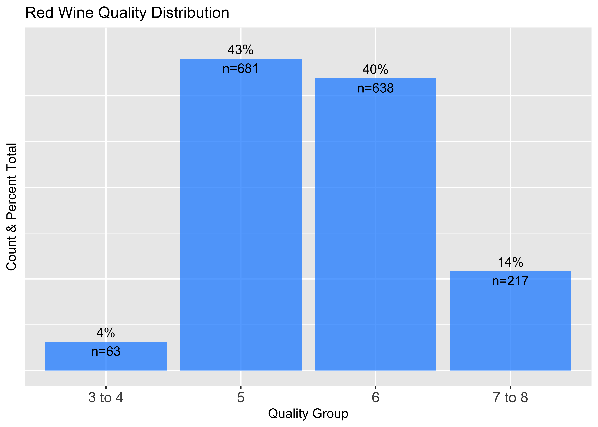

### Histogram

- Basic histogram

``` r
rw_df %>%
  ggplot(aes(x = alcohol)) +
  geom_histogram(binwidth = 0.4, alpha = 0.5, fill = "dodgerblue") +
  labs(title = "Red Wine Alcohol Distribution",
       x = "Alcohol %",
       y = "Count")
```

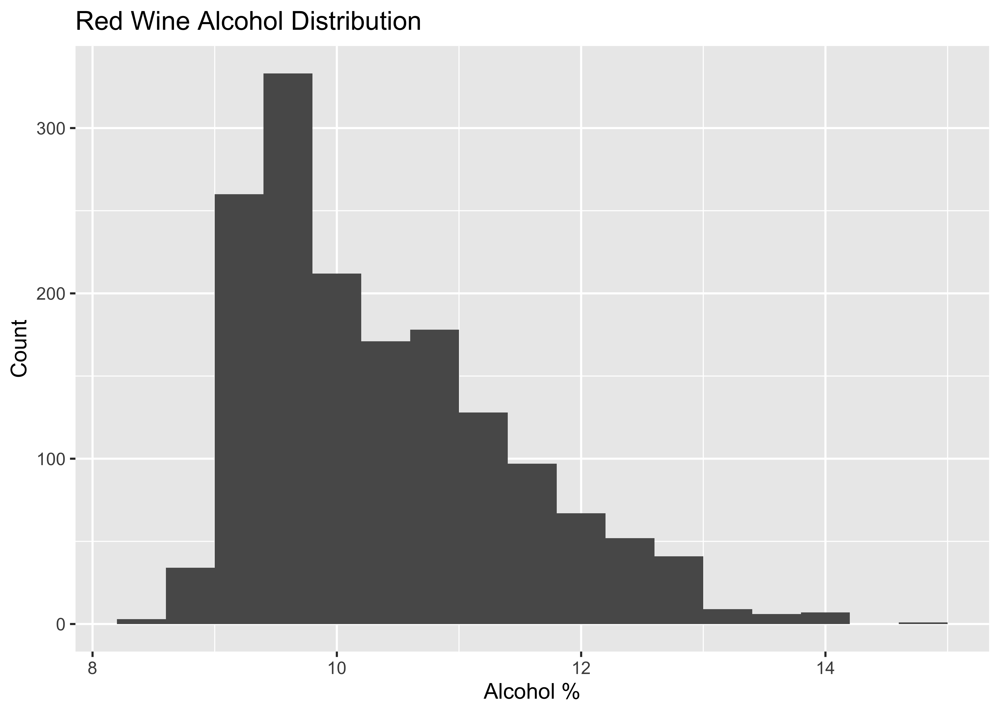

- Elevated / custom histogram design

``` r
# mean alcohol % by quality_group
# used for avg vertical line reference on histogram below
alcohol_means <- rw_df %>%
  group_by(quality_group) %>%
  summarise(mean_alcohol = mean(alcohol))

# Plotting
rw_df %>%
  ggplot(aes(x = alcohol)) +
  geom_histogram(aes(fill = quality_group), binwidth = 0.4, alpha = 0.5, show.legend = F) +
  ### add vertical line for average alcohol % by quality group
  ### geom_vline leverages the alcohol_means data frame (intermediate technique)
  geom_vline(data = alcohol_means, 
             aes(xintercept = mean_alcohol, group = quality_group, 
                 color = "Average Alochol % by Quality Group"),
             linetype = "dashed") +
  ### scale free_y allows each quality group to have its own y axis scale
  ### useful when group counts vary
  facet_grid(quality_group ~ ., scale = "free_y") +
  ### add padding/space to y axis 
  scale_y_continuous(expand = expansion(mult = c(0.05, 0.2))) +
  theme(legend.position = "top",
        axis.text.y = element_text(size = 6)) +
  ### add titles and axis labels
  labs(title = "Red Wine Alcohol % Distribution by Quality Group",
       x = "Alcohol %",
       y = "Count",
       color = "")
```

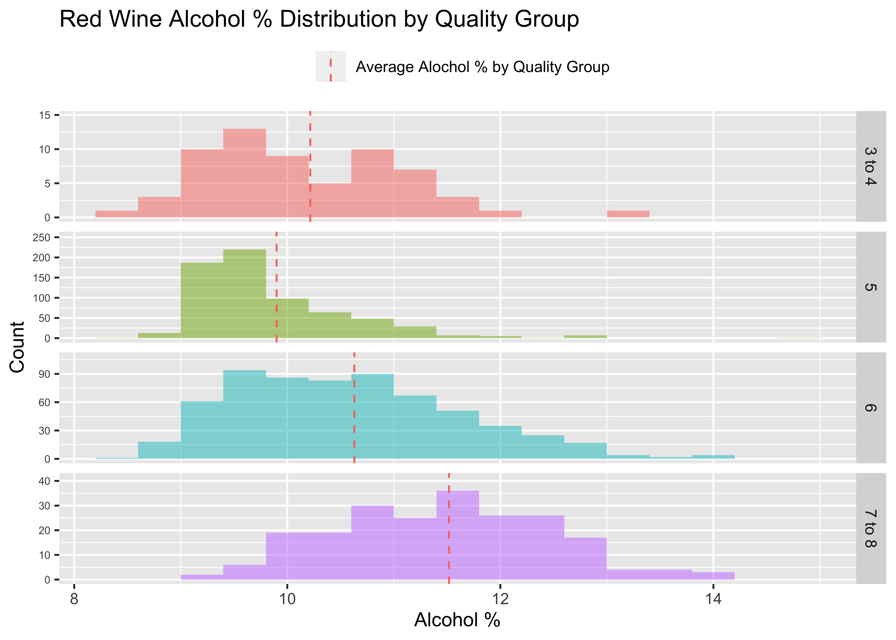

#### Boxplots

- Basic boxplot

``` r
rw_df %>%
  ggplot(aes(x = quality_group, y = sulphates)) +
  geom_boxplot(fill = "dodgerblue", alpha = 0.5) +
  labs(title = "Red Wine Sulphates Distribution by Quality Group",
       x = "Quality Group",
       y = "Sulphates")
```

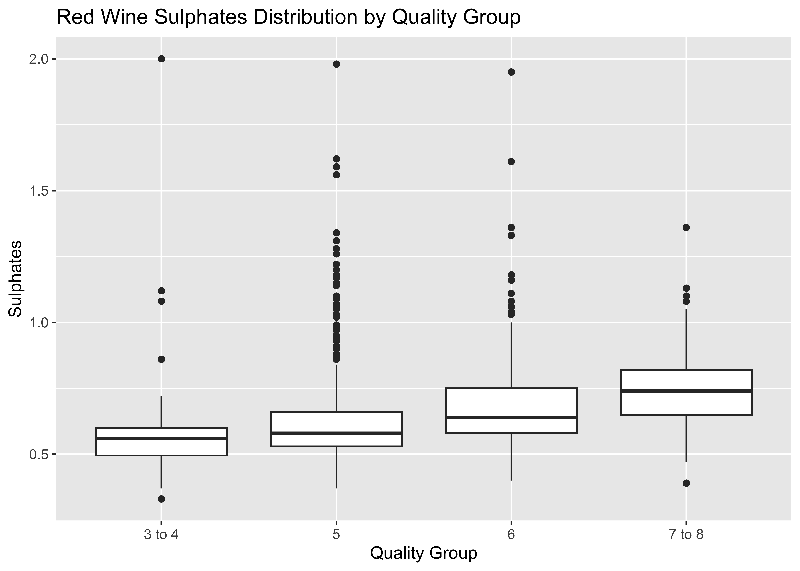

``` r
### create a long data format
custom_boxplot_setup <- rw_df %>%
      select(-quality) %>%
      pivot_longer(cols = -quality_group, names_to = "metric", values_to = "value") %>%
      group_by(quality_group, metric) %>%
      summarise(y0 = min(value),
                y25 = quantile(value, 0.25),
                y50 = median(value),
                y75 = quantile(value, 0.75),
                y100 = max(value), 
                .groups = 'drop')

custom_boxplot_setup %>%  
  ggplot(aes(x=quality_group, color=quality_group)) +
      geom_boxplot(
         # small hack here: set the min to q25 var and max to q75 var 
         # this prevents the whiskers from showing on the plot
         aes(ymin = y25, lower = y25, middle = y50, upper = y75, ymax = y75),
         stat = "identity") +
      ### cleans up variable names in the facet title strips
      facet_wrap(. ~ str_to_title(str_replace_all(metric, "_", " ")), scale="free") +
      labs(title="IQR Plots by Quality Rating and Metric",
           y="Metric Value",
           x="Quality Rating Group") +
      theme(legend.position = "none")
```

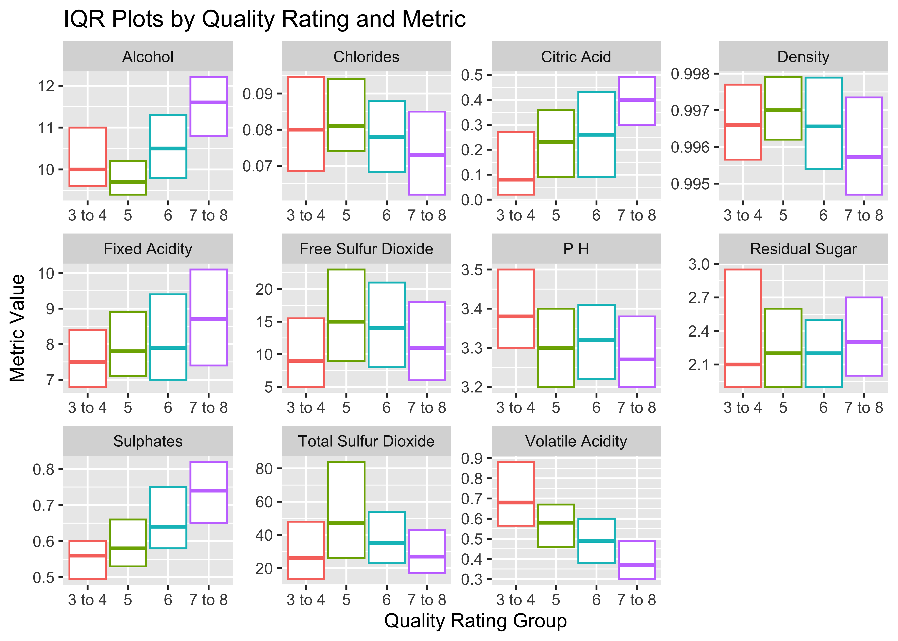

## Practice Dataset 2

- sticking to the wine theme, we’ll use yearly California and US wine
  production [data from the Wine
  Institute](https://wineinstitute.org/our-industry/statistics/california-us-wine-production/)
- the data is in a table on the website, so we’ll use rvest to scrape
  the data (thanks to GH Copilot and ChatGPT this is low lift)
- code to scrape and format the data hidden to keep the focus on ggplot2
  visualization

<!-- -->

    Rows: 56
    Columns: 3
    $ year            <dbl> 2022, 2022, 2021, 2021, 2020, 2020, 2019, 2019, 2018, …
    $ wine_segment    <fct> CA Wine, US Wine, CA Wine, US Wine, CA Wine, US Wine, …
    $ wine_production <dbl> 599.5575, 752.0772, 625.8101, 769.5786, 635.2402, 768.…

#### Time Series Trends

- Basic time series line plot

``` r
us_and_ca_wine_production %>%
  ggplot(aes(x = year, y = wine_production, color = wine_segment)) +
  geom_line() +
  labs(title = "California and US Wine Production",
       x = "Year",
       y = "Wine Production (Millions of Gallons)",
       color = "Wine Segment")
```

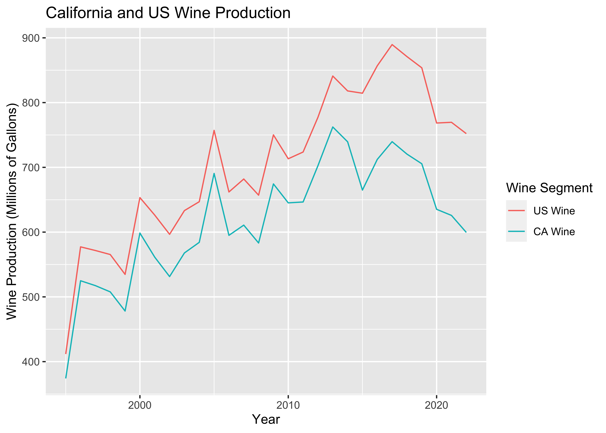

- Elevated / custom line plot design

``` r
us_and_ca_wine_production %>%
  ggplot(aes(x = year, y = wine_production, 
             color = wine_segment, shape = wine_segment)) +
  geom_line(alpha = 0.4) +
  geom_point(size = 1.75) +
  ### rotate y axis title to be horizontal
  theme(axis.title.y = element_text(angle = 0, vjust = 0.5),
        ### rotate x axis text to be slanted 45 degrees
        axis.text.x = element_text(angle = 45, hjust = 1, size = 6),
        ### drop plot minor background horizontal lines
        panel.grid.major.y = element_blank(),
        panel.grid.minor.y = element_blank(),
        panel.grid.minor.x = element_blank(),
        legend.position = "top") +
  ### set x axis breaks to be every year
  scale_x_continuous(breaks = seq(1995, 2022, 1)) +
  ### color and shape manual scales to set custom colors and shapes
  scale_color_manual(values = c("US Wine" = "grey40", "CA Wine" = "forestgreen")) +
  ### add y axis labels to both the left and right side of plot
  scale_y_continuous(sec.axis = sec_axis(~ ., name = "")) +
  ### add titles and axis labels
  labs(title = "California and US Wine Production Volume Trend",
       x = "Year",
       y = "Wine Production\n(Millions of\nGallons)",
       color = "Wine Segment",
       shape = "Wine Segment")
```

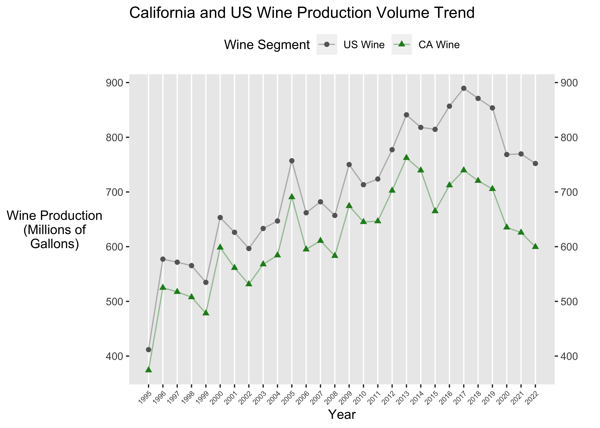

#### Scatterplots

- Basic scatterplot

``` r
us_and_ca_wine_production %>%
  ### pivot the data from long to wide format
  pivot_wider(names_from = wine_segment, values_from = wine_production) %>%
  ggplot(aes(x = `CA Wine`, y = `US Wine`)) +
  geom_point() +
  labs(title = "California and US Wine Production Relationship",
       subtitle = "Wine Production (Millions of Gallons)",
       x = "CA Wine",
       y = "US Wine")
```

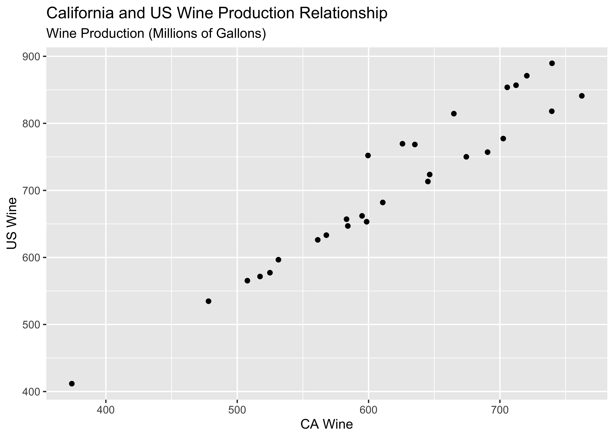

- Elevated scatterplot with labels

``` r
us_and_ca_wine_production %>%
  ### pivot the data from long to wide format
  pivot_wider(names_from = wine_segment, values_from = wine_production) %>%
  mutate(ca_wine_share_label = ifelse(`CA Wine` / `US Wine` >= 0.9, "CA >= 90%", "CA < 90%")) %>%
  ggplot(aes(x = `CA Wine`, y = `US Wine`)) +
  ### work around to use point legend for labels
  geom_point(aes(color = ca_wine_share_label), alpha = 0) +
  ### generates scatter plot with labels and repels them to avoid overlap
  geom_text_repel(aes(label = year, color = ca_wine_share_label), 
                  size = 3, box.padding = 0.05, show.legend = F) +
  ### add spearman correlation
  stat_cor(method = "spearman", p.accuracy = 0.0001) +
  ### break x and y axis by 50
  scale_x_continuous(breaks = seq(0, 1000, 50)) +
  scale_y_continuous(breaks = seq(0, 1000, 50)) +
  theme(legend.position = "top") +
  ### adjust legend alpha to 1 and point size to 3
  guides(color = guide_legend(override.aes = list(alpha = 1, size = 3))) +
  labs(title = "California and US Wine Production Relationship",
       subtitle = "Wine Production (Millions of Gallons)",
       x = "CA Wine",
       y = "US Wine",
       color = "CA Wine Share of US Total",
       caption = "Spearman Correlation")
```

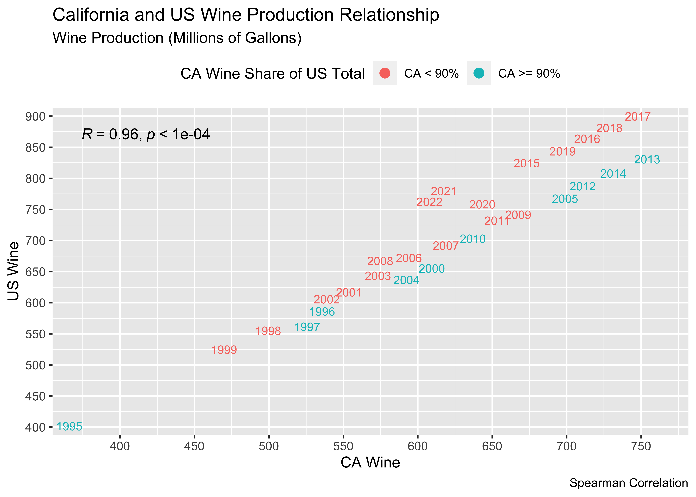

## Sample of intermediate to advanced ggplot2 techniques (future notebook todo)

- additional plot types (heatmaps, geo plots, correlation plots, etc)
- color blind friendly tactics and palettes
- custom ggplot2 functions
- programmatic visualizations (i.e. loop through data and generate plots
  by category)
- notable extension packages
